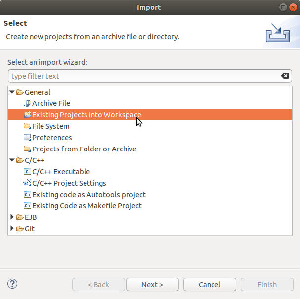
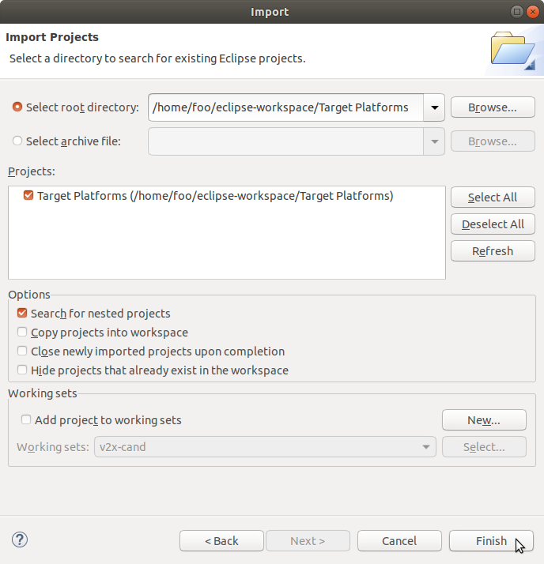
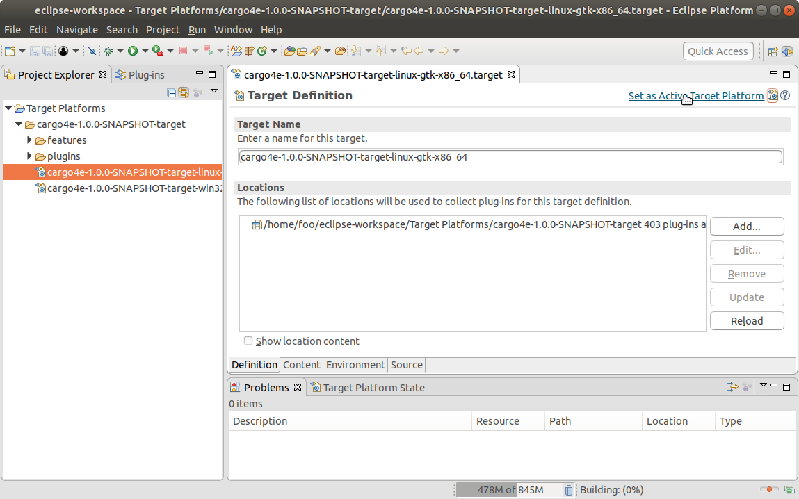
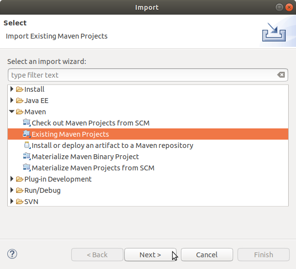
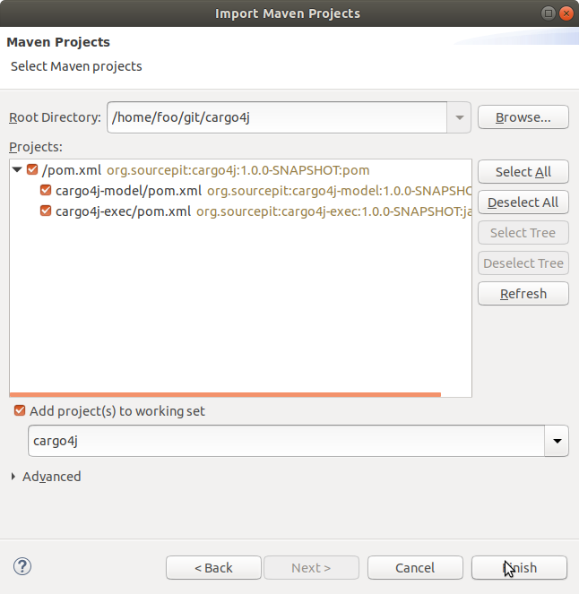
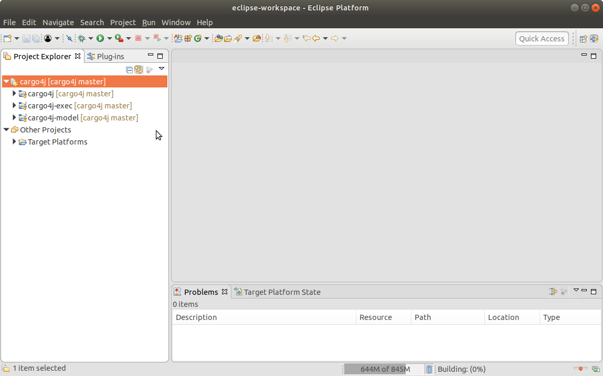
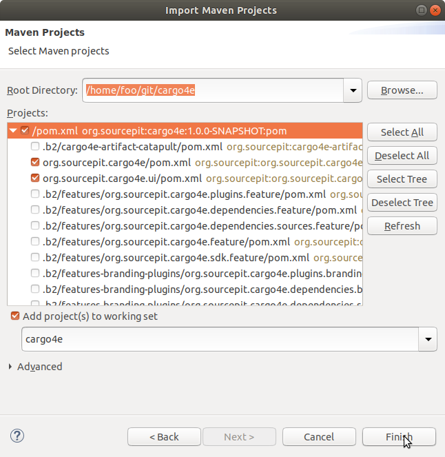
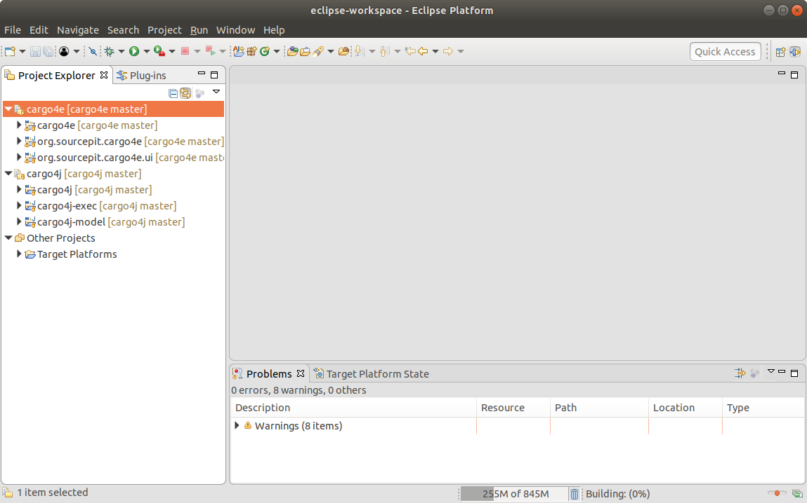

# Development

## Install Maven

https://maven.apache.org

## Build and install dependency Cargo4j (optional)

```
git clone git@github.com:sourcepit/cargo4j.git
cd cargo4j
mvn clean install
```

## Extend Maven with b2-bootstrapper

```
wget https://nexus.sourcepit.org/service/local/repositories/releases/content/org/sourcepit/b2/b2-bootstrapper/0.20.0/b2-bootstrapper-0.20.0.jar
mv b2-bootstrapper-0.20.0.jar ${MAVEN_HOME}/lib/ext/
```

## Build and save Update Sites of Cargo4e

```
cd ${CARGO4E_DIR}
mvn clean package
cp .b2/sites/org.sourcepit.cargo4e.sdk.site/target/org.sourcepit.cargo4e.sdk.site-*.zip /tmp
cp .b2/sites/org.sourcepit.cargo4e.site/target/org.sourcepit.cargo4e.site-*.zip /tmp
```

## Import Projects to Eclipse

Note: [M2Eclipse](http://www.eclipse.org/m2e/) and [Plug-in Development Environment ](http://www.eclipse.org/pde/) is required.

### Localize the Target Platform

```
cd ${CARGO4E_DIR}
mvn org.sourcepit:target-platform-maven-plugin:0.17.0:localize -Dtpmp.targetDir="$(readlink -e ~)/eclipse-workspace/Target Platforms"
```

### Import an set the Target Platform

1.  Go to: _File -> Import... -> General -> Existing Projects into Workspace_
    
    
    
2.  Select _Target Platforms_ folder
    
    
    
3.  Open the _.target_ file for your OS and set it as active Target Platform in PDE
    
    
    
### Import Maven projects of Cargo4j (optional)

1.  Go to: _File -> Import... -> Maven -> Existing Maven Projects_
    
    
    
2.  Select Cargo4j folder
    
    
    
    

### Import Maven+Tycho projects of Cargo4e

1.  Go to: _File -> Import... -> Maven -> Existing Maven Projects_
    
    
    
2.  Select Cargo4e folder (you can skip the generated projects in the _.b2_folder)
    
    
    
    
    